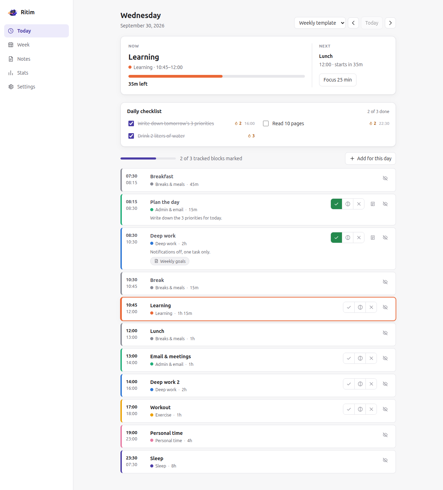
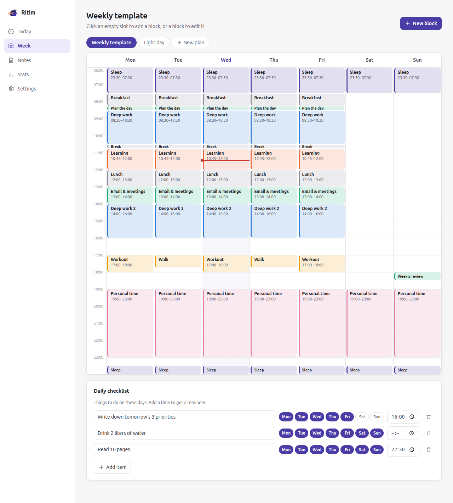
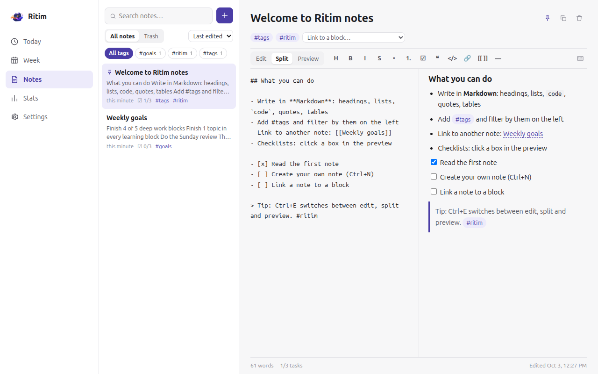
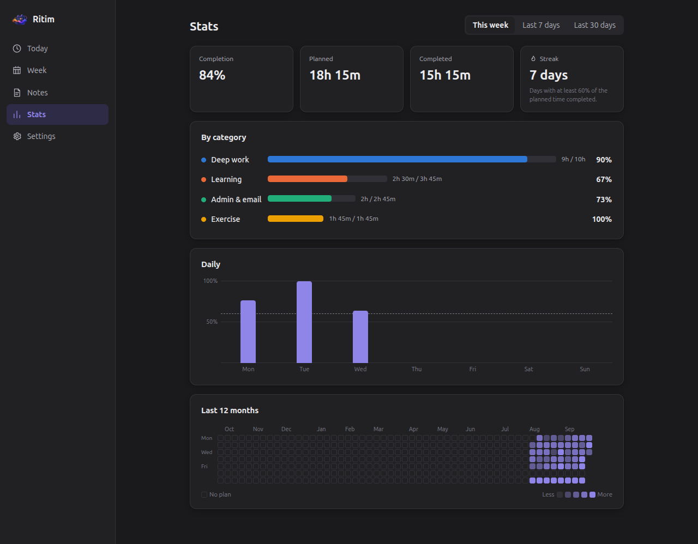

<p align="center">
  
</p>

<h1 align="center">Ritim</h1>

<p align="center">
  A weekly routine planner for Linux, Windows and macOS.<br />
  Plan your week once, get reminded as each block starts and ends, and see how much of the plan you actually did.
</p>

<p align="center">
  
</p>

## Features

**Planning**
- Weekly template with repeating blocks, shown on a calendar grid
- Drag blocks to move them, drag the bottom edge to change their length
- Blocks that cross midnight, such as sleep from 23:30 to 07:30
- Alternative day plans, such as a light day or a vacation day, that replace the template on any date you choose
- One-off blocks for a single date, and removing a block for just one day
- Calendar import: timed events from an .ics file become one-off blocks

**Reminders**
- Desktop notifications before a block starts, when it starts and before it ends
- Default reminder times, with per-block overrides
- Optional sound, do not disturb (1 hour or until tomorrow) and an end-of-day review reminder
- Tray menu that shows the current and next block and lets you mark the current one
- Focus timer with alternating focus and break periods

**Phone**
- Reminders on your phone through the free [ntfy](https://ntfy.sh) app, no account needed
- Keeps working when the computer is off: the next three days of reminders are queued on the server
- Done / Partly / Skip buttons in the notification mark the block in Ritim
- Private mode sends only generic text such as "A block has started"
- Works with ntfy.sh or your own ntfy server

**Notes**
- A Markdown editor with edit, split and preview modes, a formatting toolbar and keyboard shortcuts
- Lists and checklists continue on Enter; tick checkboxes right in the preview
- #tags with a tag filter, full-text search, pinning and sorting
- Link notes with `[[Note title]]`, with suggestions while typing and backlinks
- Attach notes to blocks; they show up under the block on the Today page
- Autosave, a trash you can restore from, and quick "New note" from the tray
- Exported to your Markdown folder too, so they appear in Obsidian

**Daily checklist**
- Recurring to-dos for chosen weekdays, ticked off on the Today page, with a streak per item
- Optional reminder time per item; the reminder is skipped if it is already ticked off

**Tracking**
- Mark each block as done, partly done or skipped, with an optional note
- Completion rate, planned and completed time per category, a daily chart and a streak
- A year view that colors every day by how much of the plan you did

**Markdown export**
- Writes a note for every day and every week into a folder you choose
- Choose a folder inside your Obsidian vault and the notes show up in Obsidian, with properties and links between days and weeks

**Everything else**
- English and Turkish interface, light and dark theme
- Starts on login and keeps running in the tray
- Tells you when a new version is published
- All data stays in a single JSON file on your computer, with import and export

| Weekly template | Notes |
|---|---|
|  |  |



## Installation

Download the package for your system from the [latest release](https://github.com/emreygc7/ritim/releases/latest).

Ritim is developed and tested on Ubuntu 26.04 with GNOME. The Windows and macOS builds are produced by the same code but have not been tested on real machines yet; please [open an issue](https://github.com/emreygc7/ritim/issues) if something doesn't work.

### Windows

1. Download `Ritim-Setup-<version>.exe` and run it. Ritim installs for your user, no admin rights needed.
2. The installer isn't code-signed, so Windows SmartScreen may say "Windows protected your PC". Click **More info**, then **Run anyway**.

To uninstall, use **Settings → Apps → Installed apps → Ritim**.

### macOS

1. Download the `.dmg` for your Mac: `arm64` for Apple Silicon (M1 and later), `x64` for Intel.
2. Open it and drag Ritim to **Applications**.
3. Ritim isn't notarized by Apple, so the first launch is blocked. Open **System Settings → Privacy & Security**, scroll down and click **Open Anyway**.

If macOS says the app "is damaged", run this once in Terminal:

```bash
xattr -cr /Applications/Ritim.app
```

### Linux

**Ubuntu, Debian, Linux Mint, Pop!_OS (.deb)**

```bash
sudo apt install ./ritim_*_amd64.deb
```

To remove it: `sudo apt remove ritim`.

**Fedora, openSUSE (.rpm)**

```bash
sudo dnf install ./ritim-*.x86_64.rpm      # Fedora
sudo zypper install ./ritim-*.x86_64.rpm   # openSUSE
```

To remove it: `sudo dnf remove ritim` or `sudo zypper remove ritim`.

**Arch Linux and other distributions (AppImage)**

```bash
chmod +x Ritim-*.AppImage
./Ritim-*.AppImage
```

AppImages need FUSE 2:

| Distribution | Package |
|---|---|
| Ubuntu 24.04 and later | `sudo apt install libfuse2t64` |
| Debian, older Ubuntu | `sudo apt install libfuse2` |
| Fedora | `sudo dnf install fuse-libs` |
| Arch Linux | `sudo pacman -S fuse2` |

**Tray icon on GNOME:** Ubuntu includes the needed extension. On Fedora, Arch and other GNOME setups, install the [AppIndicator and KStatusNotifierItem Support](https://extensions.gnome.org/extension/615/appindicator-support/) extension. KDE Plasma, Cinnamon, XFCE and MATE show the tray icon out of the box.

### From source

Requires Node.js 22 or newer.

```bash
git clone https://github.com/emreygc7/ritim.git
cd ritim
npm install
npm run install:local   # Linux: installs for your user, no sudo
```

On Windows and macOS, run `npm run dist:win` or `npm run dist:mac` and use the installer from `dist/`. To remove a Linux source install, delete `~/.local/share/ritim` and `~/.local/share/applications/ritim.desktop`.

## Getting started

1. Open Ritim and choose **Start with a sample week**, **Start empty** or **Import a file**.
2. On the **Week** page, click an empty slot to add a block, or click a block to edit it.
3. Adjust reminders, sound and autostart under **Settings**.
4. During the day, mark your blocks on the **Today** page. The **Stats** page fills up from there.

### Phone notifications

1. Install the **ntfy** app on your phone from Google Play, F-Droid or the App Store.
2. In Ritim, open **Settings → Phone notifications** and turn it on. Ritim creates a random topic name for you.
3. In the ntfy app, tap **+** and subscribe to that topic.
4. Press **Send test to phone** to check that it works.

With the Done / Partly / Skip buttons turned on, tapping one marks the block in Ritim. Taps made while the computer is off are applied the next time Ritim starts, within 12 hours.

On the public ntfy.sh server, anyone who knows your topic name can read its messages, so keep it private. Turn on **Private mode** if you don't want block names, times or notes to leave your computer.

### Obsidian and other Markdown apps

Open **Settings → Markdown export** and choose a folder, for example a `Ritim` folder in your Obsidian vault. Ritim keeps a note for each day (`2026-10-01.md`) and each week (`2026-W40.md`) up to date there, and writes your notes into a `Notes` sub-folder. A note file you edit outside Ritim is never deleted. Use **Export last 30 days** to fill in the recent past.

## Updates

Ritim checks [GitHub Releases](https://github.com/emreygc7/ritim/releases) once a day and lets you know when a new version is out. Download the new package and install it the same way; your data is kept. You can turn the check off in Settings.

## Your data

Everything is stored locally in one file:

| System | Location |
|---|---|
| Linux | `~/.config/Ritim/data.json` |
| Windows | `%APPDATA%\Ritim\data.json` |
| macOS | `~/Library/Application Support/Ritim/data.json` |

Use **Settings → Export** to back it up or move it to another computer. Nothing leaves your computer unless you turn on phone notifications, apart from the daily update check, which only asks GitHub for the latest version number.

## Development

```bash
npm run dev         # run with hot reload
npm test            # unit tests
npm run typecheck
```

## License

[MIT](LICENSE)
